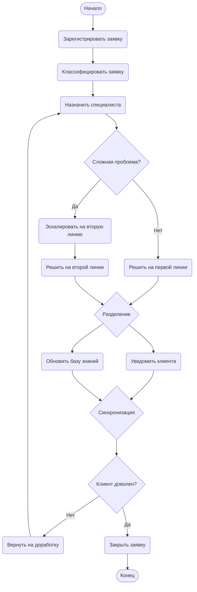

# Диаграмма деятельности: Обработка заявки в техподдержке

**Автор:** Sahakyan A.S.
**Практическая работа № 15**

## Описание процесса

Процесс обработки заявки в службе технической поддержки описывает полный цикл работы с обращением пользователя — от момента регистрации заявки до её закрытия. Клиент отправляет обращение через форму на сайте или по электронной почте. Система фиксирует заявку и присваивает ей уникальный номер. Далее заявка проходит классификацию по категории и приоритету, после чего распределяется между специалистами поддержки.

В зависимости от сложности проблемы заявка может быть решена специалистом первой линии или эскалирована на вторую линию поддержки. После решения проблемы параллельно выполняются два действия: уведомление клиента о решении и обновление базы знаний. Затем проводится проверка качества решения путём опроса клиента: если клиент удовлетворён — заявка закрывается, иначе она возвращается на доработку.

## Диаграмма деятельности



## Пояснения к ключевым шагам

1. **Зарегистрировать заявку** — поступившее от клиента обращение фиксируется в системе с присвоением уникального номера, временной метки и контактных данных заявителя.
2. **Классифицировать заявку** — заявка получает категорию (техническая, организационная, биллинг и т. д.) и приоритет (низкий, средний, высокий, критический).
3. **Назначить специалиста** — на основе категории и приоритета система автоматически или вручную выбирает ответственного исполнителя.
4. **Проверка сложности (ветвление)** — узел решения определяет, может ли проблема быть решена силами первой линии или требуется эскалация к более квалифицированным специалистам второй линии.
5. **Решить заявку** — выполняется фактическое устранение проблемы клиента (на первой или второй линии).
6. **Проверка качества (ветвление)** — после уведомления клиент оценивает качество решения. При неудовлетворительной оценке заявка возвращается на доработку (цикл).
7. **Закрыть заявку** — успешно решённая и подтверждённая клиентом заявка переводится в статус «Закрыта».

## Пояснения к параллельным ветвям (fork/join)

После решения проблемы (на любой из линий поддержки) поток управления разделяется на **две параллельные ветви**:

- **Уведомить клиента** — отправка письма или сообщения с описанием выполненного решения.
- **Обновить базу знаний** — добавление информации о проблеме и её решении в корпоративную базу знаний для последующего переиспользования.

Эти действия логически независимы друг от друга и могут выполняться одновременно. Узел **Join (синхронизация)** обеспечивает ожидание завершения обеих ветвей перед переходом к следующему этапу — проверке качества решения. Это гарантирует, что и клиент будет проинформирован, и база знаний будет дополнена ещё до того, как заявка перейдёт к финальной оценке.

## Использованные элементы диаграммы

| Элемент | Количество | Примеры |
|---------|------------|---------|
| Начальный узел | 1 | `Start([Начало])` |
| Конечный узел | 1 | `End([Конец])` |
| Действия (activity) | 8 | Зарегистрировать, Классифицировать, Назначить, Решить L1, Эскалировать, Решить L2, Уведомить, Обновить БЗ, Вернуть, Закрыть |
| Узлы решения (decision) | 2 | `Сложная проблема?`, `Клиент доволен?` |
| Разделитель (fork) | 1 | `Fork{Разделение}` |
| Соединитель (join) | 1 | `Join{Синхронизация}` |

## Контрольные вопросы

### 1. Что такое диаграмма деятельности и для чего она используется?

Диаграмма деятельности (Activity Diagram) — это вид диаграмм UML, предназначенный для моделирования динамических аспектов системы. Она показывает последовательность действий, условия ветвления, параллельные потоки и точки синхронизации. Используется для визуализации алгоритмов и бизнес-процессов, детального описания сценариев использования, выявления параллельных потоков выполнения и документирования рабочих процессов.

### 2. Чем диаграмма деятельности отличается от блок-схемы?

Блок-схемы показывают алгоритм только в терминах последовательных шагов и условий. Диаграммы деятельности имеют более широкий смысл: они могут отображать **параллельные потоки** (через fork/join), **синхронизацию** между ними, а также **распределение ответственности** между объектами/исполнителями с помощью «дорожек» (swimlanes). Кроме того, диаграммы деятельности являются частью стандарта UML и применяются для моделирования бизнес-процессов на уровне всей системы, а не только отдельных алгоритмов.

### 3. Как обозначается начальный узел в Mermaid?

В Mermaid начальный узел обозначается с использованием синтаксиса `Start([Начало])` — это создаёт узел стадиона/таблетки (rounded shape). Также может использоваться запись `([*])`. Пример:
```
Start([Начало]) --> Action1(Первое действие)
```

### 4. Как обозначается узел решения (ветвление)?

Узел решения обозначается фигурными скобками: `Идентификатор{Текст условия}` — это создаёт ромб. Каждая исходящая стрелка должна быть подписана сторожевым условием (guard condition):
```
B{Авторизация успешна?}
B -- Да --> C[Главное меню]
B -- Нет --> D[Ошибка]
```
Условия должны быть взаимоисключающими.

### 5. Как в Mermaid реализовать параллельные ветви (fork/join)?

В Mermaid нет специального синтаксиса для fork/join. Параллельность смоделировал я этим способом:

Через оператор `&` для одновременного описания нескольких рёбер:
```
Fork --> A & B
A & B --> Join
```

### 6. Зачем нужны узлы слияния (merge) и соединители (join)?

- **Узел слияния (merge)** используется для **сведения нескольких альтернативных потоков** (после ветвления decision) обратно в один. Он не выбирает путь и не ждёт завершения других — он просто пропускает поток дальше, из какой бы ветки тот ни пришёл.
- **Соединитель (join)** используется для **синхронизации параллельных потоков** (после fork). Он ожидает, пока **все** входящие ветви завершат своё выполнение, и только после этого передаёт управление дальше единым потоком.

Главное отличие: merge работает по принципу «ИЛИ» (любой из потоков), join — по принципу «И» (все потоки одновременно).

### 7. Какие правила именования действий вы знаете?

Основные правила именования действий:
- Действия именуются **глаголами** в неопределённой форме («Проверить», «Вычислить», «Отправить», «Зарегистрировать»).
- Название должно быть **кратким и однозначным**, отражать суть выполняемого шага.
- Условия в ромбах формулируются как **вопросы** или булевы выражения («Авторизация успешна?», «Товар есть?»).
- Сторожевые условия на стрелках записываются в **квадратных скобках** или как метки («Да», «Нет», «[заказ оплачен]»).
- Названия должны быть **понятны бизнес-аудитории**, без излишнего технического жаргона.

### 8. Можно ли на одной диаграмме деятельности иметь несколько конечных узлов?

Да, можно. Согласно стандарту UML, диаграмма деятельности может иметь несколько конечных узлов.

